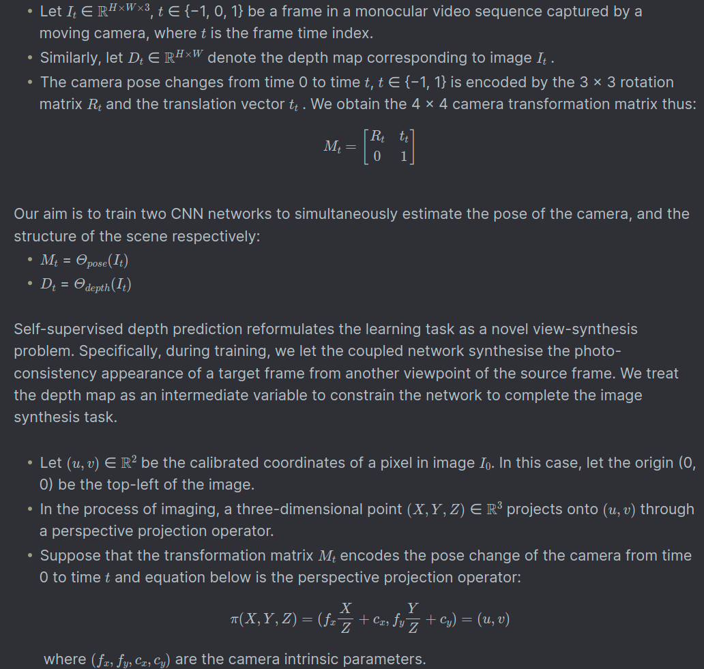
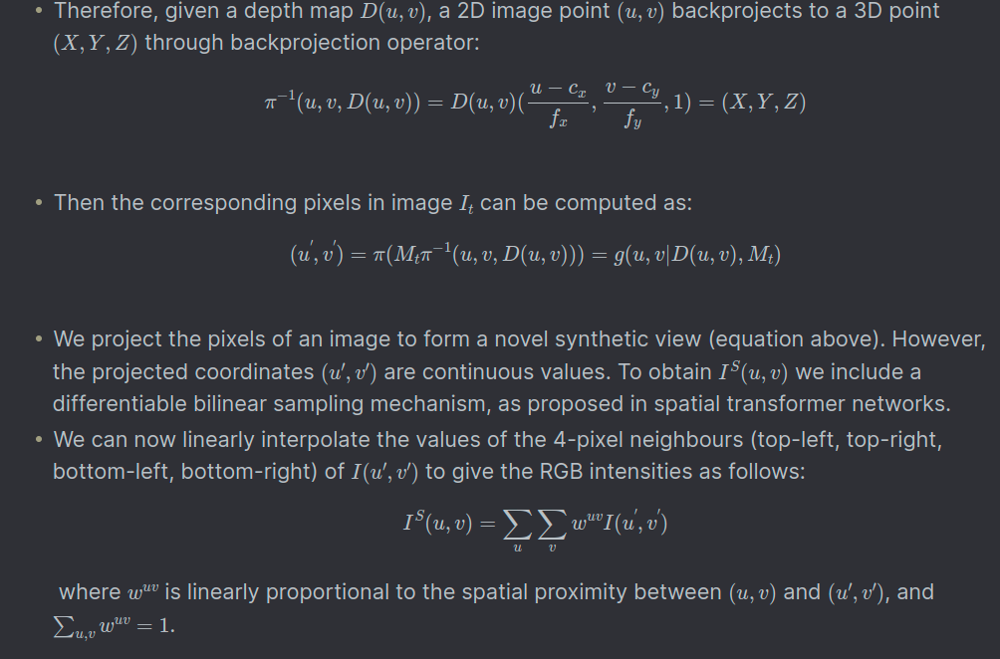
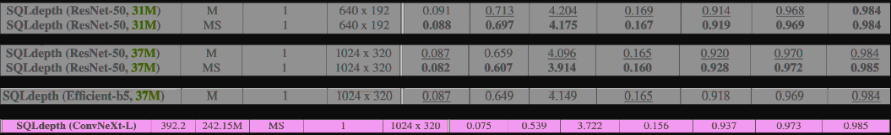
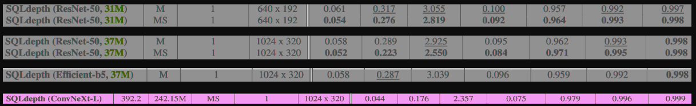

# SQLdepth


## Introduction
This is the implementation of the paper called "*SQLdepth: Generalizable Self-Supervised Fine-Structured Monocular Depth
Estimation*" (https://arxiv.org/pdf/2309.00526.pdf) for my disertation thesis.

## Theoretical prerequisites
Fundamentally, self-supervised depth estimation is a form of Structure from Motion (SfM), where the monocular camera is moving within a rigid 
environment to provide multiple views of that scene. 

The seminal work in this field is "*Digging Into Self-Supervised Monocular Depth Estimation*" (https://arxiv.org/pdf/1806.01260.pdf) upon which 
almost every self-supervised depth estimation method/paper/repo is based on (also our repo).



## Instalation
Requirements: `Ubuntu 20.04`, `NVIDIA GPU`, `CUDA >= 11.7`

You'll probably find useful this documentation [Cuda-installation-guide-Linux](https://docs.nvidia.com/cuda/cuda-installation-guide-linux/index.html#conda-installation) and also
this:
```bash
conda install cuda -c nvidia
```

In the end the goal is to be able to install `mamba-ssm` package but we'll do this in the following steps.

First create a conda environment called **sqldepth**:
```bash
conda create -n sqldepth  python=3.10  
```

Activate the new enviroment:
```bash
conda activate sqldepth
```

After that, run the following:
```bash
pip install -e .
```
or
```bash
pip install -e . && pip install -e ".[dev]"
```

Recommended to install the `[dev]` dependencies.

Sanity test: enter python command-line interface and run:
```bash
import torch
import mamba_ssm
```

## KITTI training data
You can download the entire [raw KITTI dataset](https://www.cvlibs.net/datasets/kitti/raw_data.php) by running:
```bash
wget -i src/data/kitti/kitti_archives_to_download.txt -P src/data/kitti/kitti_data/
```
The **'-i'** option in wget stands for "input-file". <br />
This option specifies a file that contains a list of URLs to download.  <br />
In this case, the file is src/data/kitti/kitti_archives_to_download.txt.  <br />
This file should contain a list of URLs, each on a new line, pointing to the files that need to be downloaded. <br />

<br />

The **'-P'** option specifies the prefix (directory) where downloaded files will be saved. <br /> 
In this case, the files are being downloaded to the src/data/kitti/kitti_data/ directory. <br />

<br />
Then unzip with:

```bash
cd src/data/kitti/kitti_data
unzip "*.zip"
cd .. # 4 times
```
<br />

**Warning**: it weighs about 175GB, so make sure you have enough space to unzip too!
<br />

Their default settings expect that you have converted the png images to jpeg with this command, **which also deletes
the raw KITTI `.png` files**:
```bash
find src/data/kitti/kitti_data/ -name '*.png' | parallel 'convert -quality 92 -sampling-factor 2x2,1x1,1x1 {.}.png {.}.jpg && rm {}'
```
**or** you can skip this conversion step and train from raw png files by adding the flag `--png` when training, at the expense of slower load times.

The above conversion command creates images which match their experiments (see [Monodepth2](https://github.com/nianticlabs/monodepth2)), where KITTI `.png` images were converted to `.jpg` on Ubuntu 16.04 
with default chroma subsampling 2x2,1x1,1x1. They found that Ubuntu 18.04 defaults to 2x2,2x2,2x2, which gives different results, hence 
the explicit parameter in the conversion command.
## Inference

```bash
python -m src.inference.test  
```

## Evaluation

```bash
python -m src.evaluation.evaluate_depth
```

### Evaluation of the pretrained models

The structure of folder containing the pretrained weights should look like this:
<br />


#### Evaluation split: eigen
| Model     | Params | WxH | abs rel | sq rel | RMSE  | RMSE log | a1    | a2    | a3    |
|-----------|--------|-----|---------|--------|-------|-------|-------|-------|-------|
| KITTI (ResNet-50)    | 31,051,944  | 640x192 | 0.088   | 0.698  | 4.175 | 0.167 | 0.919 | 0.969 | 0.984 |
| KITTI (ResNet-50) | 37,782,824  | 1024x320	 | 0.082   | 0.607  | 3.914 | 0.160 | 0.928 | 0.972 | 0.985 |
| KITTI (Efficient-b5) | 45,702,416  | 1024x320 | 0.084   | 0.539  | 3.897 | 0.162 | 0.924 | 0.971 | 0.985 |
| KITTI (ConvNeXt-L) | 242,150,304  | 1024x320 | 0.074   | 0.491  | 3.578 | 0.150 | 0.939 | 0.974 | 0.986 |

#### Paper reported results:

#### Evaluation split: eigen_benchmark
| Model     | Params | WxH | abs rel | sq rel | RMSE  | RMSE log | a1    | a2    | a3    |
|-----------|--------|-----|-------|-------|-------|-------|-------|-------|-------|
| KITTI (ResNet-50)    | 31,051,944  | 640x192 | 0.054 | 0.276 | 2.819 | 0.092 | 0.964 | 0.993 | 0.998 |
| KITTI (ResNet-50) | 37,782,824  | 1024x320	 | 0.052 | 0.223 | 2.550 | 0.084 | 0.971 | 0.995 | 0.998 |
| KITTI (Efficient-b5) | 45,702,416  | 1024x320 | 0.058 | 0.243 | 2.825 | 0.093 | 0.964 | 0.994 | 0.998 |
| KITTI (ConvNeXt-L) | 242,150,304  | 1024x320 | 0.045 | 0.147 | 2.130 | 0.070 | 0.982 | 0.997 | 0.999 |

#### Paper reported results:

## Training
```bash
python -m src.train.trainer
```

## Local overfit

The goal was to see if the SQLDepth architecture could be
overfit on a small batch of samples—typically one, two, or five images.
The ability to overfit is a litmus test for model capacity, and visual 
aids, such as the rendering of predicted depth maps, were instrumental in evaluating 
the success. If overfitting was achieved with satisfactory visual 
confirmation, the next logical step involved deploying the entire 
training pipeline on my ec2 instance, utilizing the full dataset.
```bash
python -m src.overfit.local_trainer
```

## Jupyter notebooks

You can also find some useful jupyter notebooks which have the purpose of illustrating the functionality of main parts
of this project.